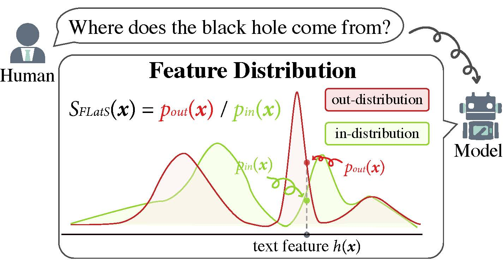

# FLatS: Principled Out-of-Distribution Detection with Feature-Based Likelihood Ratio Score
This repository contains the code for our paper [FLatS: Principled Out-of-Distribution Detection with Feature-Based Likelihood Ratio Score](https://arxiv.org/abs/2310.05083) by [Haowei Lin](https://linhaowei1.github.io/) and [Yuntian Gu](https://github.com/guyuntian).

## Quick Links

- [Overview](#overview)
- [Requirements](#requirements)
- [Training and Evaluation](#training-and-evaluation)
- [Bugs or Questions?](#bugs-or-questions)
- [Acknowledgements](acknowledgements#)
- [Citation](#citation)

## Overview

<div align="center">
    
</div>

Detecting out-of-distribution (OOD) instances is crucial for NLP models in practical applications. Although numerous OOD detection methods exist, most of them are empirical. Backed by theoretical analysis, this paper advocates for the measurement of the "OOD-ness" of a test case $\boldsymbol{x}$ through the **likelihood ratio** between out-distribution $\mathcal P_{\textit{out}}$ and in-distribution $\mathcal P_{\textit{in}}$. We argue that the state-of-the-art (SOTA) feature-based OOD detection methods, such as Maha and KNN, are suboptimal since they only estimate in-distribution density $p_{\textit{in}}(\boldsymbol{x})$. To address this issue, we propose **FLatS**, a principled solution for OOD detection based on likelihood ratio. Moreover, we demonstrate that FLatS can serve as a general framework capable of enhancing other OOD detection methods by incorporating out-distribution density $p_{\textit{out}}(\boldsymbol{x})$ estimation. Experiments show that FLatS establishes a new SOTA on popular benchmarks. 

## Requirements

First, install PyTorch by following the instructions from [the official website](https://pytorch.org/). Please use the correct 1.6.0 version corresponding to your platforms/CUDA versions to faithfully reproduce our results. PyTorch version higher than `1.6.0` should also work. For example, if you use Linux and **CUDA11** ([how to check CUDA version](https://varhowto.com/check-cuda-version/)), install PyTorch by the following command,

```
pip install torch==1.6.0+cu110 -f https://download.pytorch.org/whl/torch_stable.html
```

If you instead use **CUDA** `<11` or **CPU**, install PyTorch by the following command,

```
pip install torch==1.6.0
```

Then run the following script to install the remaining dependencies,

```
pip install -r requirements.txt
```

We use [faiss](https://github.com/facebookresearch/faiss) to run fast K-nearest neighbor search algorithm, so please follow the repo https://github.com/facebookresearch/faiss to install `faiss-cpu`.

## Training and Evaluation

In the following section, we describe how to implement FLatS based on RoBERTa model by using our code.

### Data

Before training and evaluation, please download the datasets CLINC150 and SNIPS (note that the code can directly download banking77 using Huggingface API, and the data for ROSTD and wiki has already been prepared). The default working directory is set as ``./``(current directory) in our code. You can modify it according to your need.

### Scripts

We provide the scripts to run FLatS on all the datasets. e.g., for CLINC150, train and evaluate using this command:

```bash
bash scripts/clinc.sh
```

## Bugs or questions?

If you have any questions related to the code or the paper, feel free to email [Haowei](mailto:linhaowei@pku.edu.cn). If you encounter any problems when using the code, or want to report a bug, you can open an issue. Please try to specify the problem with details so we can help you better and quicker!

## Acknowledgements

We thank [Sishuo Chen](https://pkucss.github.io/) in Peking University and his [repo](https://github.com/lancopku/Avg-Avg) for providing an extendable framework. We use this repo as a reference when developing this code base.

## Citation

Please cite our paper if you use this code or part of it in your work:

```bibtex
@inproceedings{lin2023flats,
      title={FLatS: Principled Out-of-Distribution Detection with Feature-Based Likelihood Ratio Score}, 
      author={Lin, Haowei and Gu, Yuntian},
      booktitle={Empirical Methods in Natural Language Processing (EMNLP)},
      year={2023}
}
```
